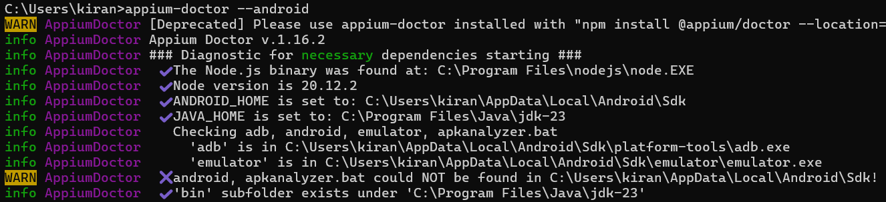
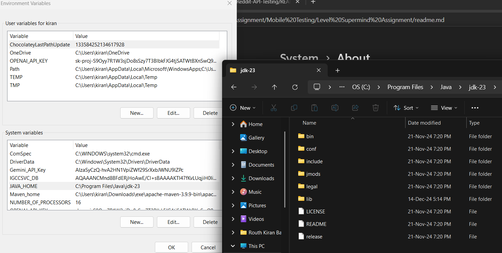
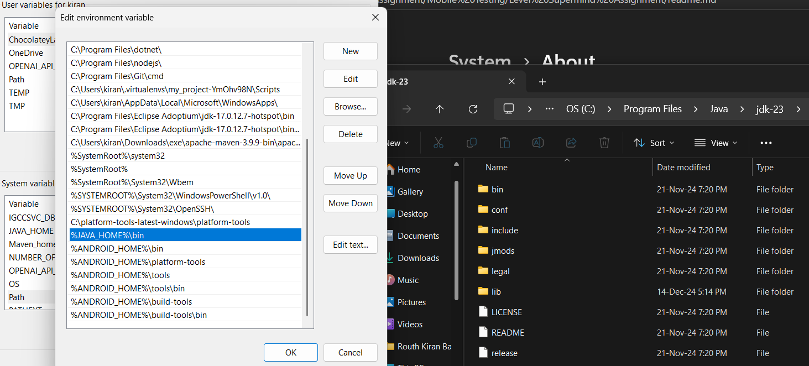
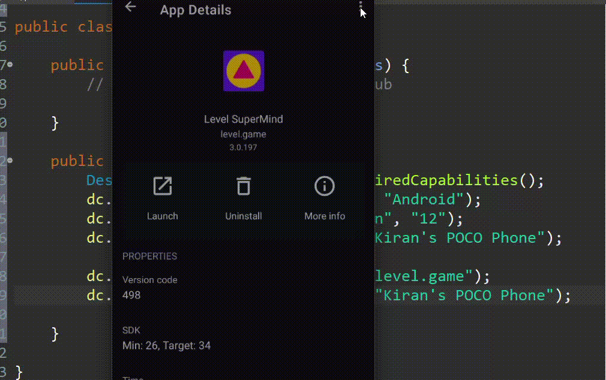
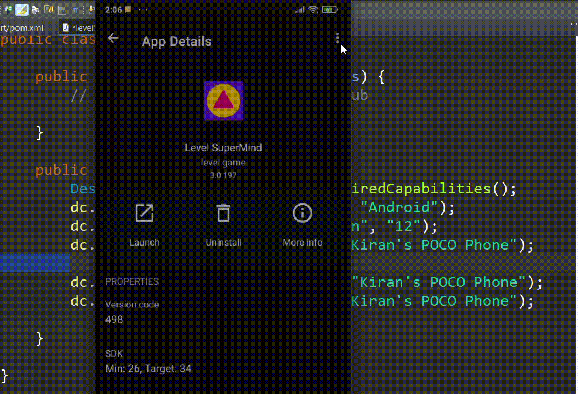
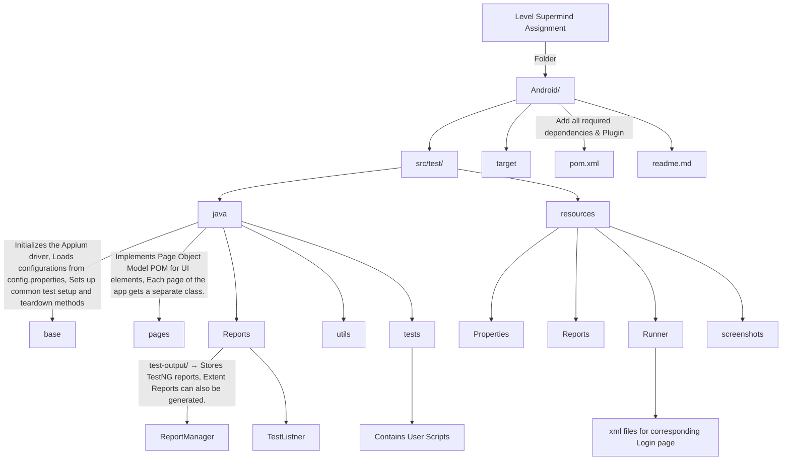

# Table of Content
 - [Click here](https://github.com/RouthKiranBabu/Masai-School-Journey/edit/main/Assignment/Mobile%20Testing/Level%20Supermind%20Assignment/readme.md#document) Given Document
 - [Click here](https://github.com/RouthKiranBabu/Masai-School-Journey/blob/main/Assignment/Mobile%20Testing/Level%20Supermind%20Assignment/readme.md#pre-requisites) Pre-requisites
 - [Click here](https://github.com/RouthKiranBabu/Masai-School-Journey/tree/main/Lectures/Appium) Manual Testing Approach/Resources to Learn
# Document 
###### Received Date: 7th Feb, 2024
## Task Description:
Develop automated test scripts to validate the login functionality of our Android and iOS
applications.
## Requirements:
 - Create separate test scripts for Android and iOS apps.
 - Android app link
https://play.google.com/store/search?q=level%20supermind&amp;c=apps
 - iOS app link
https://apps.apple.com/in/app/level-meditation-sleep-yoga/id1623828602
 - Ensure that the test scripts cover positive and negative test scenarios for the login
process.
 - Implement assertions to verify the successful login and appropriate error messages
for invalid credentials.
 - Utilize an appropriate mobile testing framework (e.g., Appium, Espresso, XCTest) for
script development.
 - Provide clear documentation on how to execute the test scripts and interpret the
results.
 - Submit the test scripts along with a brief report outlining the approach taken and any
challenges faced during development

Submission Deadline: [5 days]
This task will allow us to evaluate a candidate&#39;s technical skills, problem-solving abilities, and
familiarity with mobile test automation frameworks.
# Pre-requisites
 - [Open](https://www.oracle.com/java/technologies/downloads/#java11?er=221886) Install Java Development Kit (JDK)
 - [Open](https://www.eclipse.org/) Install Eclipse IDE
 - [Open Node.js](https://nodejs.org/en) Install Appium
   - ```java
     npm install -g appium
     npm install appium-doctor
     appium-doctor --android
     appium -v
      ```
      </img>
  - [Open](https://appium.io/docs/en/latest/) Appium GUI Desktop
  - JAVA_HOME setup in Environmental Variable.
    -  </img>
    -  </img>
  - USB Connector for real Devices and Being Developer in Android.
    <details>
     <summary>Gif</summary>
      </img>
    </details>
  - [Vysor app](https://www.vysor.io/) for both Android and Laptop/Desktop.
  - Apkinfo app - for appActivity and appPackage
    <details align = "center">
     <summary align = "left">Gif</summary>
      </img>
      </img>
    </details>
   

<details>
<summary>Folder Structure</summary>


</details>

## Manual Testing Approach
### Boundary Value Analysis 
<details>
 <summary>Phone Number Integer Value</summary>
 
| Condition | Status |
| ---: | :--- |
| < 10 | ❌ |
| > 10 | ❌ |
| = 10 | ✅ |
</details>

### Equivalent Partitioning 
<details>
 <summary>Phone Number with Different Type</summary>
 
| Condition | Status | Example |
| ---: | :--- | :---:
| Integer Type | ✅ | 1234567890 |
| Other Type or Symbol | ❌ | 123*567890 |
</details>

# Appium Code Learning/Resources
- [Link1](https://github.com/RouthKiranBabu/Masai-School-Journey/tree/main/Assignment/Mobile%20Testing)
- [Link2](https://github.com/RouthKiranBabu/Masai-School-Journey/tree/main/Lectures/Appium)
