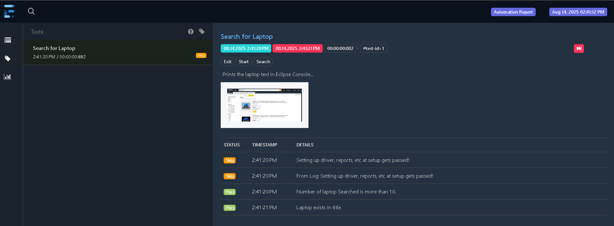
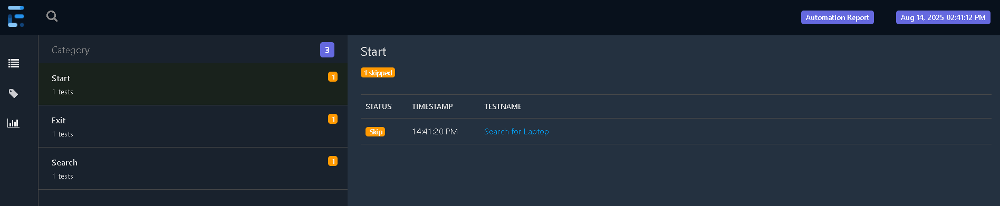

# 🪜 Steps to execute the Code
 - Create a Maven Project
 - pom.xml must have following dependencies
    - org.seleniumhq.selenium, selenium-java, 4.34.0
    - com.aventstack, extentreports, 5.1.2
    - commons-io, commons-io, 2.15.1
  - Follow the folder and code structure as it is shown in maven project
  - In testng.xml, Right click on file then Run As TestNG Suite
# 🔨 Tools and Libraries
 - Automation tool: Selenium
 - Libraries: TestNG

# Report Images

