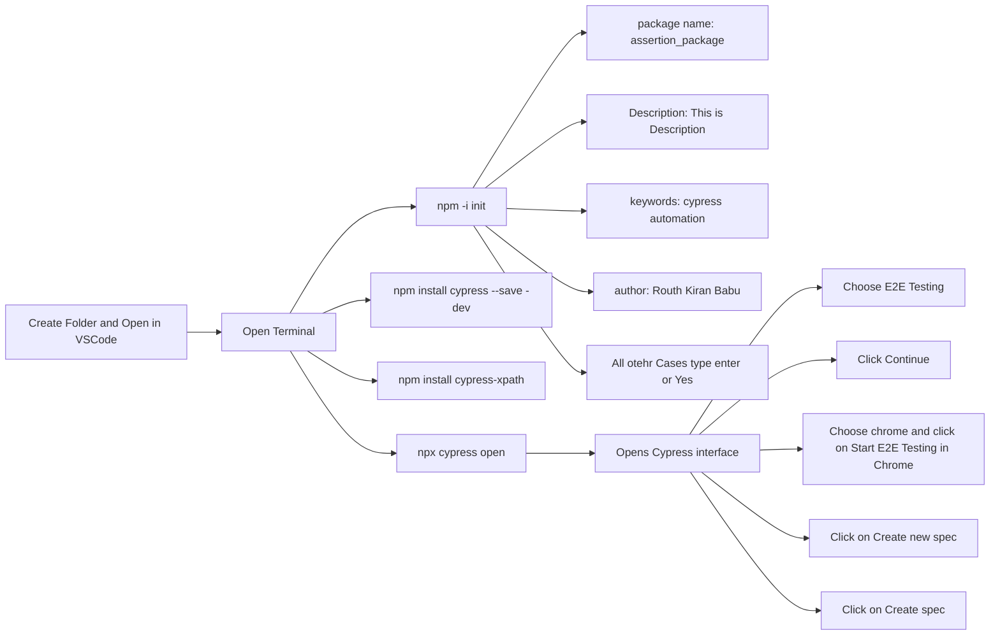

# Pre-requisites

# Importing into the File

  
|File|Code|
|--:|:--|
|command.js|`///<reference types = "cypress"/>`|
|e2e.js|`require("cypress-xpath")`|

# Useful Website for Automating
 - [`SauceDemo`](https://www.saucedemo.com/) – Great for UI automation with different user roles.
- [`The Internet - HerokuApp`](https://the-internet.herokuapp.com/) – Simple login form for testing.
- [`DemoQA`](https://demoqa.com/) – Practice login and other UI elements.
- [`Parabank`](https://parabank.parasoft.com/parabank/index.htm) – A banking demo site with login functionality.
- [`OrangeHRM`](https://opensource-demo.orangehrmlive.com/web/index.php/auth/login) – HR management system login testing.
- [`Automation Practice`](https://www.automationexercise.com/) – E-commerce site login testing.
- API Testing (Login Authentication with API Calls):
  - [`ReqRes`](https://reqres.in/) – Fake API for testing login and CRUD operations.
  - [`Restful-Booker`](https://restful-booker.herokuapp.com/) – API testing with login authentication.
