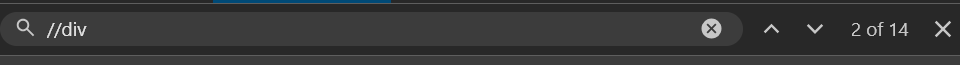
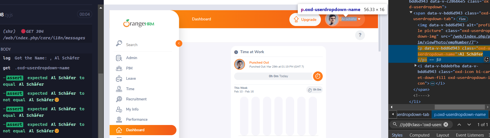

# Pre-requisites
<details>
  <summary>Install Cypress and Creating Spec</summary>

   </img>
</details>

> [!NOTE]
> Cypres Run Command: `npx cypress run --spec "cypress/e2e/Part07.cy.js" --browser chrome --headed`. [Learn](https://docs.github.com/en/get-started/writing-on-github/getting-started-with-writing-and-formatting-on-github/basic-writing-and-formatting-syntax#alerts)

## Importing into the File

<div align = center>
  
|File|Added Code|
|--:|:--|
|command.js|`///<reference types = "cypress"/>`|
|e2e.js|`require("cypress-xpath")`|
</div>

# Assertions
<div align = right>

Official Website - [Click Here](https://docs.cypress.io/app/references/assertions)
</div>

## Using Implicit Assertions
```javascript
describe('Assertions demo', () => {
    it('Implicit Assertions', () => {
        cy.visit("https://www.saucedemo.com/")
        cy.url().should('include', "saucedemo.com")
        cy.url().should('eq', "https://www.saucedemo.com/")
        cy.url().should('contain', 'saucedemo')
    });
});
```
> [!WARNING]
> In the above code we are `using the cy.url() again and again`. [Learn](https://docs.github.com/en/get-started/writing-on-github/getting-started-with-writing-and-formatting-on-github/basic-writing-and-formatting-syntax#alerts)
```javascript
describe('Assertions demo', () => {
    it('Implicit Assertions', () => {
        cy.visit("https://www.saucedemo.com/")
        cy.url().should('include', "saucedemo.com")
        .should('eq', "https://www.saucedemo.com/")
        .should('contain', 'saucedemo')
    });
});
```
> [!TIP]
> It's better to `call the url once` and use the assertion multiple times.

> [!NOTE]
> We are using the `should Multiple times`.
```javascript
describe('Assertions demo', () => {
    it('Implicit Assertions', () => {
        cy.visit("https://www.saucedemo.com/")
        cy.url().should('include', "saucedemo.com")
        .and('eq', "https://www.saucedemo.com/")
        .and('contain', 'saucedemo')
        .and('not.contain', 'sdemo') // Using not
    });
});
```

## Assertion for Title and Logo Visibility
```javascript
describe('Assertions demo', () => {
    it('Implicit Assertions', () => {
        cy.visit("https://www.saucedemo.com/")
        cy.title().should('eq', 'Swag Labs')
        .and('include', 'Labs')
        .and('contain', 'Swag')

        cy.get('.login_logo').should('be.visible')
        // Alternative of Above
        cy.get('.login_logo').should('exist')
    });
});
```

## To check Logo Visibility and Existance
```javascript
describe('Assertions demo', () => {
    it('Implicit Assertions', () => {
        cy.visit("https://www.saucedemo.com/")
        // Logo is visible or not and exist or not
        cy.get('.login_logo').should('be.visible')
        .and('exist')
    });
});
```

<details>
  <summary>Cypress Best Feature</summary>
  <h3>Getting Elements From Cypress</h3>
   </img>
</details>

## To find the Number of Div Tag
```javascript
describe('Assertions demo', () => {
    it('Implicit Assertions', () => {
        cy.visit("https://www.saucedemo.com/")
        cy.xpath("//div").should('have.length', "14")
    });
});
```

<details>
  <summary>Image</summary>
  <h3>Getting Elements From Cypress</h3>
   </img>
</details>

## To Check Provided input as Expected
```javascript
describe('Assertions demo', () => {
    it('Implicit Assertions', () => {
        cy.visit("https://www.saucedemo.com/")
        cy.get("input[placeholder='Username']").type("standard_user")
        .should('have.value', 'standard_user')
    });
});
```

## To Check TDD and BDD Assertions
```javascript
describe('Assertions demo', () => {
    before(() => {
        cy.visit("https://opensource-demo.orangehrmlive.com/web/index.php/auth/login")
        cy.get("input[placeholder='Username']").type("Admin")
        cy.get("input[placeholder='Password']").type("admin123")
        cy.get("button[type='submit']").click()
    })
    it('TDD and BDD Style', () => {
        let expname = "Al Schäfer"
        cy.log("Got the Name: ", expname)
        cy.get(".oxd-userdropdown-name").then(($ele)=>{
            let actname = $ele.text()
            cy.log(actname)
            // BDD Style
            expect(actname).to.equal(expname)
            expect(actname).to.not.equal(expname + "😊")
            // TDD Style
            assert.equal(actname, expname)
            assert.notEqual(actname, expname + "😊")
        })
    });
});
```

<details>
  <summary>Image</summary>
  <h3>Getting Elements From Cypress</h3>
   </img>
</details>


# Useful Website for Automating
 - [`SauceDemo`](https://www.saucedemo.com/) – Great for UI automation with different user roles.
- [`The Internet - HerokuApp`](https://the-internet.herokuapp.com/) – Simple login form for testing.
- [`DemoQA`](https://demoqa.com/) – Practice login and other UI elements.
- [`Parabank`](https://parabank.parasoft.com/parabank/index.htm) – A banking demo site with login functionality.
- [`OrangeHRM`](https://opensource-demo.orangehrmlive.com/web/index.php/auth/login) – HR management system login testing.
- [`Automation Practice`](https://www.automationexercise.com/) – E-commerce site login testing.
- API Testing (Login Authentication with API Calls):
  - [`ReqRes`](https://reqres.in/) – Fake API for testing login and CRUD operations.
  - [`Restful-Booker`](https://restful-booker.herokuapp.com/) – API testing with login authentication.

# Resource😊
 - [Video](https://www.youtube.com/playlist?list=PLUDwpEzHYYLvA7QFkC1C0y0pDPqYS56iU)
