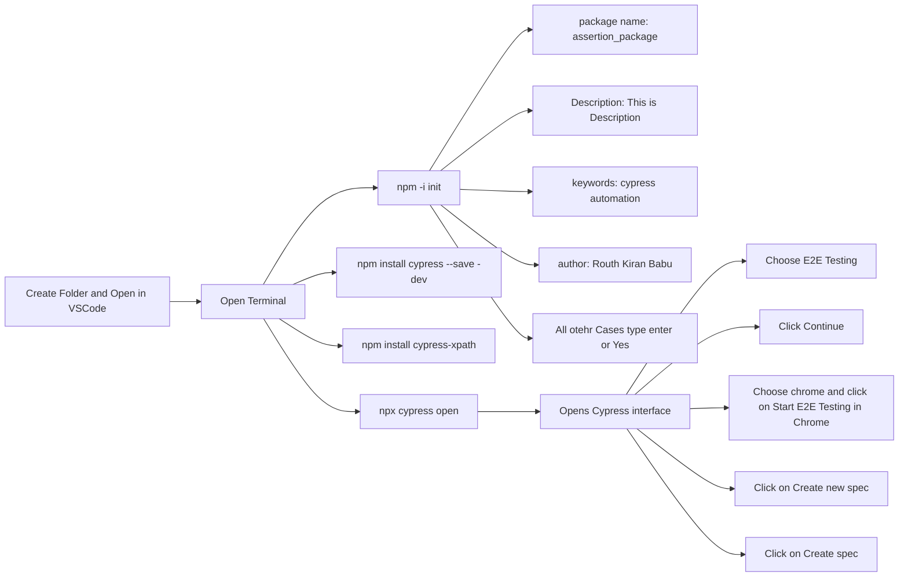

# Pre-requisites

```mermaid
graph LR;
a[Create Folder and Open in VSCode] --> b[Open Terminal]
b --> c[npm -i init]
c --> d[package name: assertion_package]
c --> e[Description: This is Description]
c --> f[keywords: cypress automation]
c --> g[author: Routh Kiran Babu]
c --> h[All otehr Cases type enter or Yes]
b --> i[npm install cypress --save -dev]
b --> j[npm install cypress-xpath]
b --> k[npx cypress open] --> l[Opens Cypress interface]
l --> m[Choose E2E Testing]
l --> n[Click Continue]
l --> o[Choose chrome and click on Start E2E Testing in Chrome]
l --> p[Click on Create new spec]
l --> q[Click on Create spec];
```
