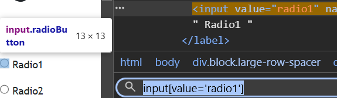
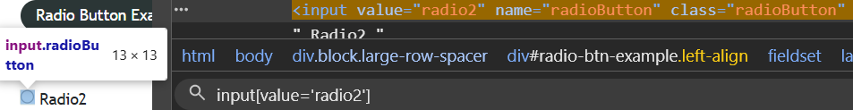
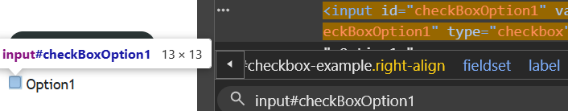
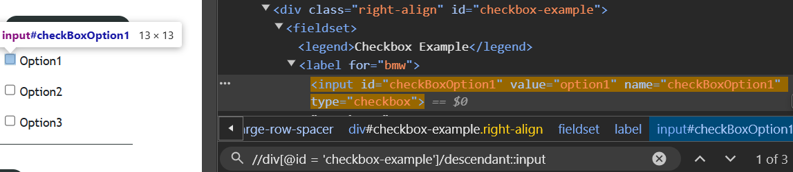

# Pre-requisites
 - [Website](https://rahulshettyacademy.com/AutomationPractice/)
## Locations
<details>
 <summary>input[value='radio1']</summary>

 </img>
</details>
<details>
 <summary>input[value='radio2']</summary>

 </img>
</details>
<details>
 <summary>input#checkBoxOption1</summary>

 </img>
</details>
<details>
 <summary>//div[@id = 'checkbox-example']/descendant::input</summary>

 </img>
</details>

# Code
## Code For Radio Buttons
```javascript
describe('Check UI Elements', () => {
    it('Checking Radio Buttons', () => {
        cy.visit("https://rahulshettyacademy.com/AutomationPractice/")
        cy.xpath("(//div[starts-with(@class, 'left') and contains(@id, 'btn')]/descendant::input)[1]").should('be.visible')
        cy.get("input[value='radio1']").should('be.visible')
        cy.get("input[value='radio1']").check().should('be.checked')
        cy.get("input[value='radio2']").should('not.be.checked')
        cy.wait(2000)
        cy.get("input[value='radio2']").check().should('be.checked')
        cy.get("input[value='radio1']").should('not.be.checked')
    });
});
```
## Code for Check Boxes
```javascript
describe('Checking Check Boxes', () => {
    beforeEach(() => {
        cy.visit("https://rahulshettyacademy.com/AutomationPractice/")
    });
    it('Test Script', () => {
        cy.get('input#checkBoxOption1').should('be.visible')
        cy.get('input#checkBoxOption1').check().should('be.checked')
        cy.wait(2000)
        cy.get('input#checkBoxOption1').uncheck().should('not.be.checked')
    });
    it('Selecting All CheckBoxes One by One', () => {
        cy.xpath("(//div[starts-with(@class, 'right')]/descendant::input)[1]").check().should('be.checked')
        cy.xpath("(//div[starts-with(@class, 'right')]/descendant::input)[2]").check().should('be.checked')
        cy.xpath("(//div[starts-with(@class, 'right')]/descendant::input)[3]").check().should('be.checked')
    });
    it('Selecting All CheckBoxes One at a Time', () => {
        cy.xpath("//div[@id = 'checkbox-example']/descendant::input").uncheck().should('not.be.checked')
        cy.wait(2000)
        cy.xpath("//div[@id = 'checkbox-example']/descendant::input").check().should('be.checked')
    });
    it('Selecting First and Last Element', () => {
        cy.xpath("//div[@id = 'checkbox-example']/descendant::input").first().check().should('be.checked')
        cy.wait(2000)
        cy.xpath("//div[@id = 'checkbox-example']/descendant::input").last().check().should('be.checked')
    });
});
```
# Automation
 </img>
