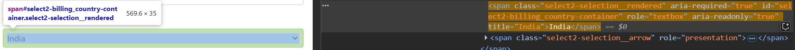
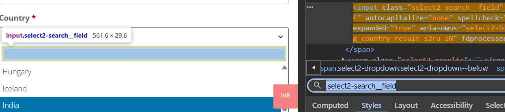

# Pre-requisites
 - 

      
Making Cypress

      
    

 - Websites:
   - [Zoho](https://www.zoho.com/commerce/free-demo.html)
   - [Dummyticket](https://www.dummyticket.com/dummy-ticket-for-visa-application/)
  - Xpath, cssSelector, id etc used:
    - 

      
#zcf_address_country

      
    

    
    - 

      
#select2-billing_country-container

      
    

    - 

      
.select2-search__field

      
    

  - 

    
Working of Dropdown in Dummyticket

    
  

  
  - 

    
To run a Program

      - `npx cypress open`
      - `npx cypress run --browser chrome`
      - `npx cypress run --browser edge`
      - `npx cypress run --spec "cypress/e2e/mytest.cy.js"`
      - `npx cypress run --headed`
  

