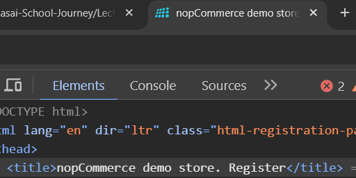
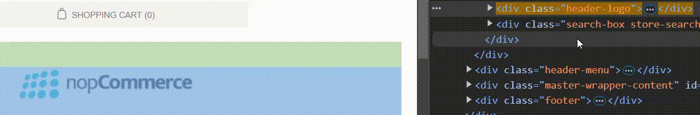
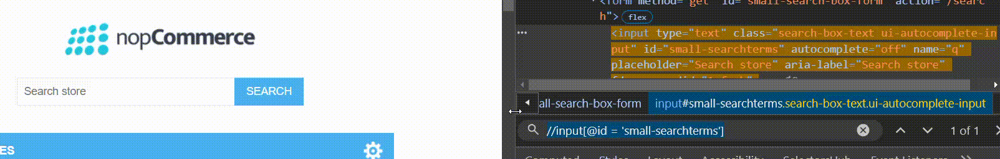
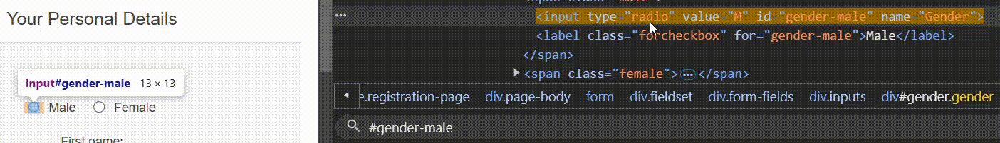
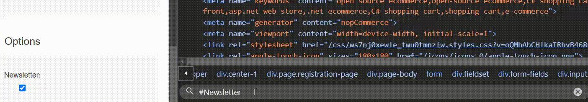
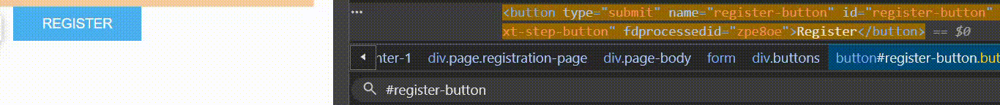
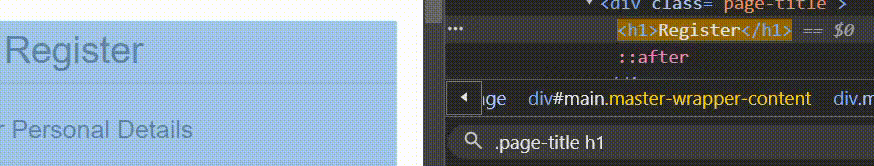
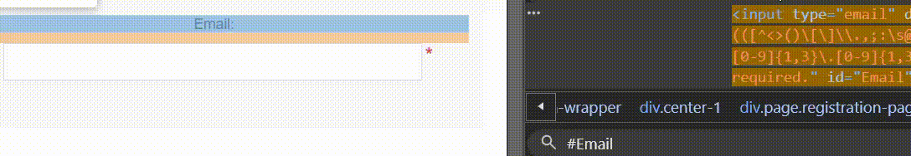
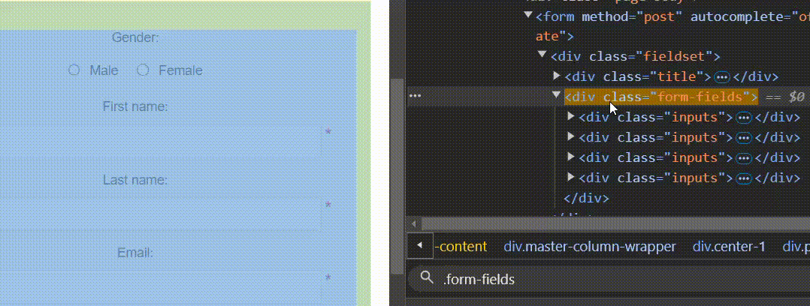
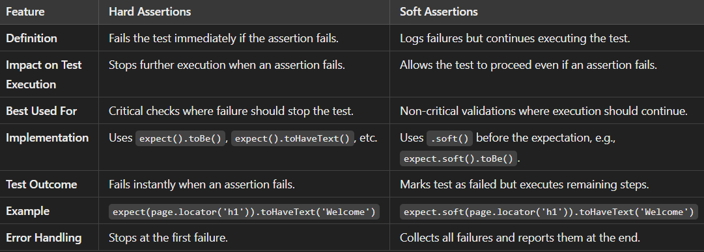

# Playwright Assertions
<div align = right>

Official Website - [Click Here](https://playwright.dev/docs/test-assertions#auto-retrying-assertions)
</div>
<div align = center width = 100%>
  
|Assertion|Description|
|-:|:-|
|`expect(page).toHaveURL()`|Page has URL|
|`expect(page).toHaveTitle()`|Page has title|
|`expect(locator).toBeVisible()`|Element is Visible|
|`expect(locator).toBeEnabled()`|Control is Enabled|
|`expect(locator).toBeDisabled()`|Element is Disabled|
|`expect(locator).toBeChecked()`|Radio/Checkbox is checked|
|`expect(locator).toHaveAttribute()`|Element has Attribute|
|`expect(locator).toHaveText()`|Element matches text|
|`expect(locator).toContaintext()`|Element Contains Text|
|`expect(locator).toHaveValue(value)`|Input has a Value|
|`expect(locator).toHaveCount()`|List of elements has given length|
</div>

> [!TIP]
> In playwright.config.js -> testDir: './tests/Part07_Assertions' So you can run all the tests in on Space. [Learn](https://docs.github.com/en/get-started/writing-on-github/getting-started-with-writing-and-formatting-on-github/basic-writing-and-formatting-syntax#alerts)

# Assertions
## For URL
```javascript
    await page.goto('https://demo.nopcommerce.com/register')
    await expect(page).toHaveURL('https://demo.nopcommerce.com/register')
    await page.waitForTimeout(3000); // Waits for 3 seconds
  ```
## For Title
```javascript
  await expect(page).toHaveTitle('nopCommerce demo store. Register')
```

<details>
  <summary>Image</summary>

   </img>
</details>

## For Header Logo Visibility
```javascript
    const logoElement = await page.locator('.header-logo')  
    await expect(logoElement).toBeVisible()
```

<details>
  <summary>Gif</summary>

   </img>
</details>

## For Search Box Enable
```javascript
    const searchStoreBox = await page.locator("//input[@id = 'small-searchterms']")
    await expect(searchStoreBox).toBeEnabled()
```

<details>
  <summary>Gif</summary>

   </img>
</details>

## For Male Radio Button Enable
```javascript
    const maleRadioButton = await page.locator('#gender-male')  // For radio button
    await maleRadioButton.click()                               // Select Radio Button
    await expect(maleRadioButton).toBeChecked()
```

<details>
  <summary>Gif</summary>

   </img>
</details>

## For NewsLetter Check
```javascript
    const newsCheckBox = await page.locator('#Newsletter')
    await expect(newsCheckBox).toBeChecked()
```

<details>
  <summary>Gif</summary>

   </img>
</details>

## For RegisterButton Having Attribute
```javascript
    const regbutton = await page.locator('#register-button')
    await expect(regbutton).toHaveAttribute('type', 'submit')
```

<details>
  <summary>Gif</summary>

   </img>
</details>

## To Check Exact text and Partial text
```javascript
    // To check exact text
    await expect(await page.locator('.page-title h1')).toHaveText('Register')
    // To check partial text
    await expect(await page.locator('.page-title h1')).toContainText('ister')
```

<details>
  <summary>Gif</summary>

   </img>
</details>

## Email InputBox having Value
```javascript
    const emailinput = await page.locator('#Email')
    await emailinput.fill('test@demo.com')
    await expect(emailinput).toHaveValue('test@demo.com')
```

<details>
  <summary>Gif</summary>

   </img>
</details>

## To check Number of Child Div
```javascript
    const options = await page.locator('.form-fields')
    await expect(options).toHaveCount(4)
```

<details>
  <summary>Gif</summary>

   </img>
</details>

# Negative Assertions

<div align = 'right'>
  
  [Official Link](https://playwright.dev/docs/test-assertions#auto-retrying-assertions)
</div>

<div align = center width = 100%>
  
|Assertion|Description|
|-:|:-|
|`expect(page).not.toHaveURL()`|Page has URL|
|`expect(page).not.toHaveTitle()`|Page has title|
|`...`|...|
</div>

# Soft Assertions

<div align = 'right'>
  
  [Official Link](https://playwright.dev/docs/test-assertions#soft-assertions)
</div>

<details>
  <summary>Examples</summary>

  ```javascript
  // Make a few checks that will not stop the test when failed...
  await expect.soft(page.getByTestId('status')).toHaveText('Success');
  await expect.soft(page.getByTestId('eta')).toHaveText('1 day');
  
  // ... and continue the test to check more things.
  await page.getByRole('link', { name: 'next page' }).click();
  await expect.soft(page.getByRole('heading', { name: 'Make another order' })).toBeVisible();
  ```
</details>


# Difference between Hard Assertions and Soft Assertions
 </img>
