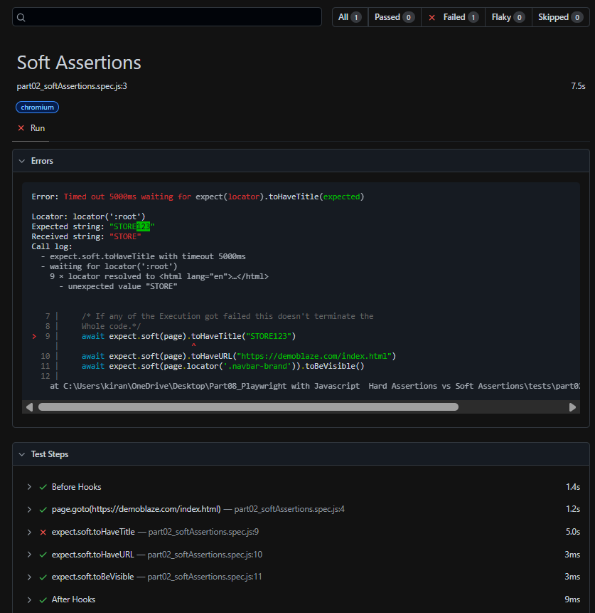

<div align = center>

Official Website - [Link for Soft Assertions](https://playwright.dev/docs/test-assertions#soft-assertions)
</div>

>[!WARNING]
>Provided Wrong Title.

# Code for Hard Assertions
## Code
```javascript
const {test, expect} = require("@playwright/test")

test("Hard Assertions", async ({page}) => {
    await page.goto("https://demoblaze.com/index.html")
    
    // Hard Assertions
    await expect(page).toHaveTitle("STORE123")
    await expect(page).toHaveURL("https://demoblaze.com/index.html")
    await expect(page.locator('.navbar-brand')).toBeVisible()
    // npx playwright test part01_hardAssertions.spec.js --project chromium
})
```
## Report
 </img>
>[!NOTE]
>In Hard Assertions if something fails its stops without executing below.

# Code for Soft Assertions
## Code
```javascript
const {test, expect} = require("@playwright/test")

test("Soft Assertions", async ({page}) => {
    await page.goto("https://demoblaze.com/index.html")
    
    // Soft Assertions
    /* If any of the Execution got failed this doesn't terminate the
    Whole code.*/
    await expect.soft(page).toHaveTitle("STORE123")
    await expect.soft(page).toHaveURL("https://demoblaze.com/index.html")
    await expect.soft(page.locator('.navbar-brand')).toBeVisible()

    // npx playwright test part02_softAssertions.spec.js --project chromium
})
```
## Report
 </img>
>[!NOTE]
>In Soft Assertions if something fails its does not stops executing below code.
