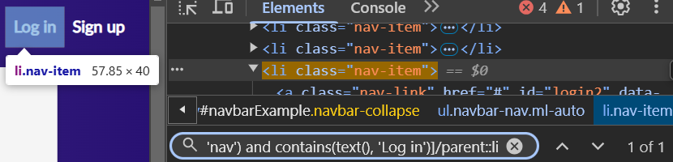

# Xpaths
<details>
  <summary>//a[starts-with(@class, 'nav') and contains(text(), 'Log in')]/parent::li</summary>
 </img>
</details>

# Code
<div align=right>
  
Open file 👉[click here](https://github.com/RouthKiranBabu/Masai-School-Journey/blob/main/Lectures/PlayWright/Part09_Playwright%20with%20Javascript%20%20How%20to%20handle%20Input%20box_Radio%20Buttons/tests/Package/test01.spec.js)
</div>

```javascript
const {test, expect} = require("@playwright/test")
// npx playwright test Package/test01.spec.js --project=chromium --headed
test.skip('Handle Inputbox', async ({page}) => {
    await page.goto("https://demoblaze.com/index.html")
    await expect(await page.locator("//a[starts-with(@class, 'nav') and contains(text(), 'Log in')]/parent::li")).toBeVisible()
    await expect(await page.locator("//a[starts-with(@class, 'nav') and contains(text(), 'Log in')]/parent::li")).toBeEnabled()
    await page.locator("//a[starts-with(@class, 'nav') and contains(text(), 'Log in')]/parent::li").click()
    
    await expect(await page.locator("(//input[contains(@id, 'log')])[1]")).toBeVisible()
    await expect(await page.locator("(//input[contains(@id, 'log')])[1]")).toBeEmpty()
    await expect(await page.locator("(//input[contains(@id, 'log')])[1]")).toBeEditable()
    await expect(await page.locator("(//input[contains(@id, 'log')])[1]")).toBeEnabled()
    await page.locator("(//input[contains(@id, 'log')])[1]").fill('pavanol')
    await expect(await page.locator("(//input[contains(@id, 'log')])[1]")).toHaveValue('pavanol')

    await page.waitForTimeout(2000);
    await expect(await page.locator("(//input[contains(@id, 'log')])[2]")).toBeVisible()
    await expect(await page.locator("(//input[contains(@id, 'log')])[2]")).toBeEmpty()
    await expect(await page.locator("(//input[contains(@id, 'log')])[2]")).toBeEditable()
    await expect(await page.locator("(//input[contains(@id, 'log')])[2]")).toBeEnabled()
    await page.fill("(//input[contains(@id, 'log')])[2]", 'test@123')
    await expect(await page.locator("(//input[contains(@id, 'log')])[2]")).toHaveValue('test@123')
    await page.waitForTimeout(5000);

});

test('Handling Radio Buttons', async ({page}) => {
    await page.goto("https://rahulshettyacademy.com/AutomationPractice/")
    await page.locator("(//div[@class='left-align']/descendant::input)[1]").check()
    await expect(await page.locator("(//div[@class='left-align']/descendant::input)[1]")).toBeChecked()
    // await page.locator("(//div[@class='left-align']/descendant::input)[1]").isChecked() --> Returns true or false
    // then comparing with the truthy
    await expect(await page.locator("(//div[@class='left-align']/descendant::input)[1]").isChecked()).toBeTruthy()
    await page.waitForTimeout(2000)
    
    await page.check("(//div[@class='left-align']/descendant::input)[2]")
    await expect(await page.locator("(//div[@class='left-align']/descendant::input)[3]").isChecked()).toBeFalsy()
    await page.waitForTimeout(5000)
});
```

# Automation
 </img>
