```mermaid
graph TD;
a[Level Supermind Assignment]-->|Folder| b[Android/];
b --> c[src/test/]
c --> f[java]
f --> |Initializes the Appium driver, Loads configurations from config.properties, Sets up common test setup and teardown methods| h[base]
f --> |Implements Page Object Model POM for UI elements, Each page of the app gets a separate class.| i[pages]
f --> j[Reports]
j --> |test-output/ → Stores TestNG reports, Extent Reports can also be generated.| k[ReportManager]
j --> TestListner
f --> n[utils]
f --> l[tests]
l --> m[Contains User Scripts]
c --> g[resources]
g --> Properties
g --> Reports
g --> p[Runner]
p --> q[xml files for corresponding Login page]
g --> screenshots
b --> d[target]
b --> |Add all required dependencies & Plugin| e[pom.xml]
b --> readme.md
```

# Github Readme Editing Notes

# A first-level heading
## A second-level heading
### A third-level heading

> [!NOTE]
> Useful information that users should know, even when skimming content.

> [!TIP]
> Helpful advice for doing things better or more easily.

> [!IMPORTANT]
> Key information users need to know to achieve their goal.

> [!WARNING]
> Urgent info that needs immediate user attention to avoid problems.

> [!CAUTION]
> Advises about risks or negative outcomes of certain actions.

normal_text 
**bold_text** 
*italic text* 
***bold and italic***

<!--This is a comment and 
backslash(\) for breaking the line.-->
This is <sub>subscript</sub>.\
This is <sup>superscript</sup>.\
<ins>Underlined</ins>

> Text which is quoted.

This is `Quoted code` word.

```
inside a three backticks
AS a test
```

Going to the [linkedin](https://www.linkedin.com/in/routhkiranbabu/) Page\
<div align = 'center'>

</div>

Click here to goto the foot note[^1]

- first head
  - first sub
    - first insub
    - second insub
  - second sub
- second head
1. first
2. second

 - [x] task done 1
 - [x] task done 2
 - [ ] task done 3
- [ ] (Optional) Open a followup issue

second foot note[^2]
[^1]: My reference.
[^2]: To add line breaks within a footnote, prefix new lines with 2 spaces.
  This is a second line.

<div align = center width = 100%>
  
| Day Number | Tasks | Branch Link |
| :---: | :--- | ---: |
| `1` | Cypress Setup, [Learning Readme editing.](https://docs.github.com/en/get-started/writing-on-github/getting-started-with-writing-and-formatting-on-github/quickstart-for-writing-on-github#introduction), [Learning Git Commands.](https://github.com/RouthKiranBabu/Reddit-API-Testing/tree/day_4?tab=readme-ov-file#git-commands) | [Day 1](https://github.com/RouthKiranBabu/testReddit/tree/day_1) |
| `2` | FirstLine.</br>SecondLine. | [Day 2]
</div>

<details>
  <summary>Click to Open</summary>

  <p>Some text</p>
</details>

<details>
<summary>Flow chart</summary>


</details>

<p align="center">
<!-- Python --><a href = "https://www.python.org/"></a><!-- Java --><a href = "https://www.oracle.com/java/"></a>
</p>

<!--Get Github and leetcode stats 
by the help of chatGPT-->
<details>
 <summary>🤖 Playwright</summary>
<div align='center'>


<div>
</details>

To See same of [github Profile](https://github.com/RouthKiranBabu/RouthKiranBabu/blob/main/README.md)
 <!--Ask to the ChatGPT
 can you provide the tech stack badges to add in the github readme for the manual testing where I have experience with jira, excel, SDLC and STLC, functional and non functional, regression testing-->
