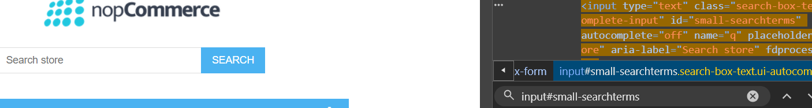
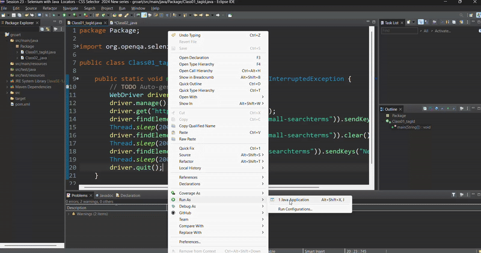

# Pre-requisites
<details>
  <summary>Creating Maven Project</summary>

   </img>
</details>

# CSS Selector

<div align = center>
  
|From|To|
|--:|:--|
|`tag id`|tag#id|
|`tag class`|tag.classname|
|`tag attribute`|tag[attribute="value"]|
|`tag class attribute`|tag.classname[attribute="value"]|
</div>

>[!NOTE]
>Tag is Optional. You may or may not Provide the tag.😊
>```javascript
>driver.findElement(By.cssSelector("input#small-searchterms")).sendKeys("T-Shirts");
>driver.findElement(By.cssSelector("#small-searchterms")).sendKeys("New T-Shirts");
>```

## Code for Tag id
```javascript
package Package;

import org.openqa.selenium.By;
import org.openqa.selenium.WebDriver;
import org.openqa.selenium.chrome.ChromeDriver;

public class Class01_tagId {

	public static void main(String[] args) throws InterruptedException {
		// TODO Auto-generated method stub
		WebDriver driver = new ChromeDriver();
		driver.manage().window().maximize();
		driver.get("https://demo.nopcommerce.com/");
		driver.findElement(By.cssSelector("input#small-searchterms")).sendKeys("T-Shirts");
		Thread.sleep(2000);
		driver.findElement(By.cssSelector("input#small-searchterms")).clear();
		Thread.sleep(2000);
		driver.findElement(By.cssSelector("#small-searchterms")).sendKeys("New T-Shirts");
		Thread.sleep(2000);
		driver.quit();
	}
}
```
## Result

<details>
  <summary>CSS Selector</summary>

   </img>
</details>

<details>
  <summary>Automation</summary>

   </img>
</details>

