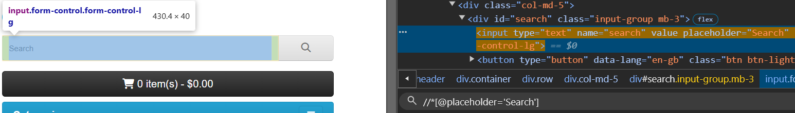
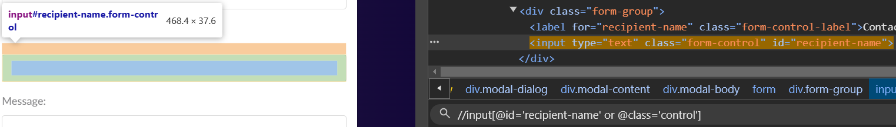
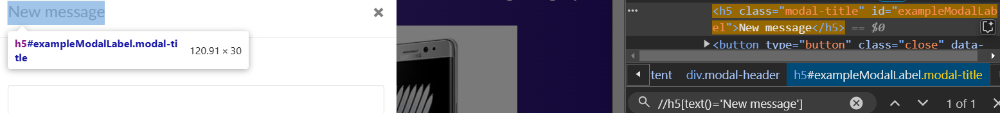
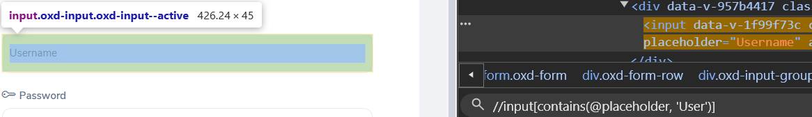
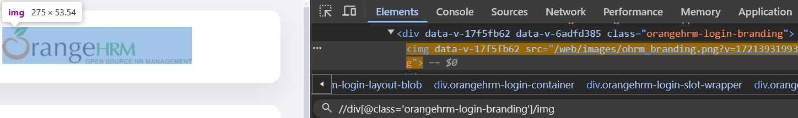

# Pre-requisites
<details>
  <summary>Creating Maven Project</summary>

   </img>
</details>

# Coding Section
## Code for XPath with Single Attribute
```javascript
package Package;

import org.openqa.selenium.By;
import org.openqa.selenium.WebDriver;
import org.openqa.selenium.chrome.ChromeDriver;

public class Class00_ {

	public static void main(String[] args) throws InterruptedException {
		// TODO Auto-generated method stub
		WebDriver driver = new ChromeDriver();
		driver.manage().window().maximize();
		driver.get("https://demo.opencart.com/");
		
		driver.findElement(By.xpath("//input[@placeholder='Search']")).sendKeys("T-Shirts");
		Thread.sleep(2000);
		driver.findElement(By.xpath("//*[@placeholder='Search']")).clear();
		Thread.sleep(2000);
		driver.findElement(By.xpath("//input[@placeholder='Search']")).sendKeys("New T-Shirts");
		Thread.sleep(2000);
		
		driver.quit();
	}
}
```
>[!NOTE]
>Above code is by using the single Attribute.
><details>
>  <summary>XPath Location</summary>
>
>   </img>
></details>
## Code for XPath with Multiple Attribute
```javascript
package Package;

import org.openqa.selenium.By;
import org.openqa.selenium.WebDriver;
import org.openqa.selenium.chrome.ChromeDriver;

public class Class01_usingMultiAttribute {

	public static void main(String[] args) throws InterruptedException {
		// TODO Auto-generated method stub
		WebDriver driver = new ChromeDriver();
		driver.manage().window().maximize();
		driver.get("https://demo.opencart.com/");
		
		driver.findElement(By.xpath("//input[@placeholder='Search'][@name='search']")).sendKeys("T-Shirts");
		Thread.sleep(2000);
		driver.findElement(By.xpath("//*[@placeholder='Search'][@name='search']")).clear();
		Thread.sleep(2000);
		driver.findElement(By.xpath("//*[@placeholder='Search'][@name='search']")).sendKeys("New T-Shirts");
		Thread.sleep(2000);
		
		driver.quit();
	}
}
```
>[!NOTE]
>Above code is by using the single Attribute.
><details>
>  <summary>XPath Location</summary>
>
>   </img>
></details>
## Code for XPath with using And Operator
```javascript
package Package;

import org.openqa.selenium.By;
import org.openqa.selenium.WebDriver;
import org.openqa.selenium.chrome.ChromeDriver;

public class Class02_andAndOrOperator {

	public static void main(String[] args) throws InterruptedException {
		// TODO Auto-generated method stub
		WebDriver driver = new ChromeDriver();
		driver.manage().window().maximize();
		driver.get("https://demoblaze.com/index.html");
		
		driver.findElement(By.xpath("//a[@class='nav-link' and contains(text(), 'Contact')]")).click();
		Thread.sleep(2000);
		driver.findElement(By.xpath("//input[@id='recipient-email' and @class='form-control']")).sendKeys("Username Value");
		Thread.sleep(4000);
		
		driver.quit();
	}
}
```
>[!NOTE]
>Above code is by using and/or operator.
><details>
>  <summary>Or Operator</summary>
>
>```javascript
>driver.findElement(By.xpath("//input[@id='recipient-name' or @class='control']")).sendKeys("Contact Value");
>```
>   </img>
></details>
><details>
>  <summary>And Operator Automation</summary>
>
>   </img>
></details>
## Xpath with Inner Text
### Syntax
```python
//tag[text() = 'text']
```
### Example Code
```javascript
String txt = driver.findElement(By.xpath("//h5[text()='New message']")).getText();
boolean isdisplayed = driver.findElement(By.xpath("//h5[text()='New message']")).isDisplayed();
System.out.println("Got text: " + txt + " and Status of Displayed is " + isdisplayed + "."); // Got text: New message and Status of Displayed is true.
```
<details>
  <summary>XPath</summary>

   </img>
</details>

## Xpath with Contains

### Syntax Example
```python
//input[contains(@placeholder, 'Sea')]
```
### Example Code
```javascript
newdriver.findElement(By.xpath("//input[contains(@placeholder, 'User')]")).sendKeys("Admin");
```
<details>
  <summary>XPath</summary>

   </img>
</details>

## Xpath with Start-with()

### Syntax Example
```python
//input[starts-with(@placeholder, 'Sea')]
```
### Example Code
```javascript
newdriver.findElement(By.xpath("//input[starts-with(@placeholder, 'Pass')]")).sendKeys("admin123");
```
<details>
  <summary>XPath</summary>

   </img>
</details>

>[!TIP]
>Handling Dynamic Attribute:
>`//*[@id='start' or @id='stop']`, `//*[contains(@id, 'st')]` and  `//*[starts-with(@id, 'st')]`

## Chained Xpath

### Syntax Example
```python
//div[@class='orangehrm-login-branding']/img
```
### Example Code
```javascript
boolean islogodisplayed = newdriver.findElement(By.xpath("//div[@class='orangehrm-login-branding']/img")).isDisplayed();
System.out.println("Status of displaying Logo: " + islogodisplayed);
```
<details>
  <summary>XPath</summary>

   </img>
</details>

# Summary Code
```javascript
package Package;

import org.openqa.selenium.By;
import org.openqa.selenium.WebDriver;
import org.openqa.selenium.chrome.ChromeDriver;

public class Class02_andAndOrOperator {

	public static void main(String[] args) throws InterruptedException {
		// TODO Auto-generated method stub
		WebDriver driver = new ChromeDriver();
		driver.manage().window().maximize();
		driver.get("https://demoblaze.com/index.html");
		
		driver.findElement(By.xpath("//a[@class='nav-link' and contains(text(), 'Contact')]")).click();
		Thread.sleep(2000);
		driver.findElement(By.xpath("//input[@id='recipient-email' and @class='form-control']")).sendKeys("Username Value");
		Thread.sleep(2000);
		driver.findElement(By.xpath("//input[@id='recipient-name' or @class='control']")).sendKeys("Contact Value");
		Thread.sleep(2000);
		String txt = driver.findElement(By.xpath("//h5[text()='New message']")).getText();
		boolean isdisplayed = driver.findElement(By.xpath("//h5[text()='New message']")).isDisplayed();
		System.out.println("Got text: " + txt + " and Status of Displayed is " + isdisplayed + "."); // Got text: New message and Status of Displayed is true.
		Thread.sleep(2000);
//		driver.findElement(By.xpath("(//span[@aria-hidden = 'true'])[1]")).click();
//		Thread.sleep(4000);
		driver.quit();
		
		WebDriver newdriver = new ChromeDriver();
		Thread.sleep(2000);
		newdriver.manage().window().maximize();
		newdriver.get("https://opensource-demo.orangehrmlive.com/web/index.php/auth/login");
		Thread.sleep(2000);
		newdriver.findElement(By.xpath("//input[contains(@placeholder, 'User')]")).sendKeys("Admin");
		Thread.sleep(2000);
		newdriver.findElement(By.xpath("//input[starts-with(@placeholder, 'Pass')]")).sendKeys("admin123");
		Thread.sleep(2000);
		boolean islogodisplayed = newdriver.findElement(By.xpath("//div[@class='orangehrm-login-branding']/img")).isDisplayed();
		System.out.println("Status of displaying Logo: " + islogodisplayed);
		
		newdriver.quit(); // 1:17:56
	}
}
```
<details>
  <summary>Automation</summary>

   </img>
</details>
