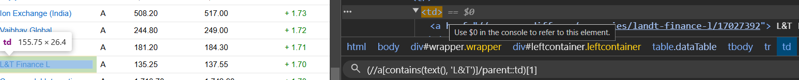
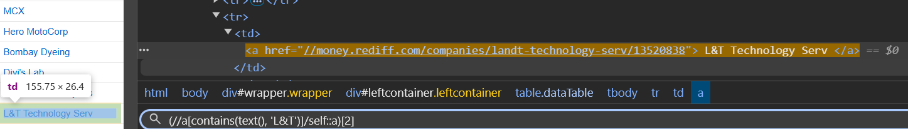

# Pre-requisites
## PDF For Theory 👉[Click here](https://github.com/RouthKiranBabu/Masai-School-Journey/blob/main/Lectures/Selenium/Session%2025%20-%20Selenium%20with%20Java%20%20Locators%20-%20XPath%20Axes%20%20SelectorsHub%20%202024%20New%20series/groart/imgif/LocatingElement.pdf)

# Pre-requisites
<details>
  <summary>For Parent TD</summary>

   </img>
</details>
<details>
  <summary>For Self</summary>

   </img>
</details>

# Coding Section
```javascript
/*Create a Maven Project in pom file attact:
<dependencies>
  <!-- https://mvnrepository.com/artifact/org.seleniumhq.selenium/selenium-java -->
<dependency>
    <groupId>org.seleniumhq.selenium</groupId>
    <artifactId>selenium-java</artifactId>
    <version>4.28.1</version>
</dependency>

  </dependencies>
  
Right click on Maven Project -> Maven -> Update Project -> Check Force Update of Snapshots/Releases -> Ok (Then it adds dependencies at the project)
Create a Package contains java script in the src/main/java*/
package Package;

import java.util.List;
import org.openqa.selenium.By;
import org.openqa.selenium.WebDriver;
import org.openqa.selenium.WebElement;
import org.openqa.selenium.chrome.ChromeDriver;

public class class01 {

	public static void main(String[] args) {
		// TODO Auto-generated method stub
		WebDriver driver = new ChromeDriver();
		driver.manage().window().maximize();
		driver.get("https://money.rediff.com/gainers/bse/daily/groupa");
//		Self - Selects the current node
		String text = driver.findElement(By.xpath("//a[contains(text(), 'L&T')]/self::a")).getText();
		System.out.println("Self: " + text); // Self: L&T
//		Parent - Selects the parent of the current node (always One)
		text = driver.findElement(By.xpath("//a[contains(text(), 'L&T')]/parent::td")).getText();
		System.out.println("Parent: " + text); // Parent: L&T
//		Child - Selects all children of the current node (One or Many)
		List<WebElement> childs = driver.findElements(By.xpath("//a[contains(text(), 'L&T')]/ancestor::tr/child::td"));
		System.out.println("Number of child Elements: " + childs.size());

//		All ancestor (parent, grandparent, etc.)
		text = driver.findElement(By.xpath("//a[contains(text(), 'L&T')]/ancestor::tr")).getText();
		System.out.println("Ancestor: " + text);

//		Descendants (children, grandchildren, etc) of the current node.
		List<WebElement> descendants = driver
				.findElements(By.xpath("//a[contains(text(), 'L&T')]/ancestor::tr/descendant::*"));
		System.out.println("Number of descendant nodes: " + descendants.size());

//		Everything in the document after the closing tag of the current node
		List<WebElement> followingnodes = driver
				.findElements(By.xpath("//a[contains(text(), 'L&T')]/ancestor::tr/following::tr"));
		System.out.println("Number of following nodes: " + followingnodes.size());

//		all nodes that appear before the current node in the document
		List<WebElement> precedings = driver
				.findElements(By.xpath("//a[contains(text(), 'L&T')]/ancestor::tr/preceding::tr"));
		System.out.println("Number of preceding nodes: " + precedings.size());
		/*Output
		Self: L&T
		Parent: L&T
		Number of child Elements: 12
		Ancestor: L&T A 3,667.65 3,725.90 + 1.59 Buy  |  Sell
		Number of descendant nodes: 20
		Number of following nodes: 301
		Number of preceding nodes: 345*/

////		Selects all siblings after the current node
//		List<WebElement> followingsiblings = driver.findElements(By.xpath("//a[contains(text()), 'Zomato']/ancestor::tr/following-sibling::*"));
//		System.out.println("Number of Following nodes: " + followingsiblings.size());
//
////		Selects all siblings before the current node
//		List<WebElement> precedingsiblings = driver.findElements(By.xpath("//a[contains(text()), 'Adani Energy Solutio']/ancestor::tr/preceding-sibling::*"));
//		System.out.println("Number of preceding sibling nodes: " + precedingsiblings.size());

		driver.close();
	}

}
```
